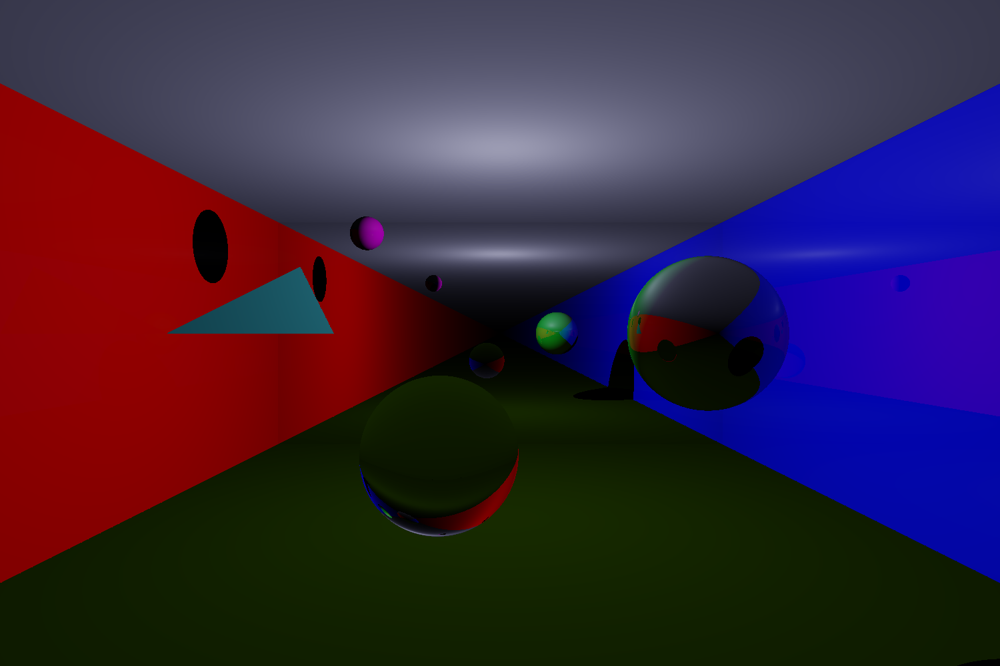

# smoke_and_mirrors

An attempt to learn ray tracing techniques and showcase them in a scene containing mirrors and wavelength dependent diffraction of light.
Possible additions - smoke/fog.

Checkpoints:

- [x] Basic ray caster (Lambertian diffuse shading and Blinn-Phong specular shading), shadows included
- [x] Recursive specular shading
- [] Difraction
- [] Path tracer
- [] Ray tracing optimisations (BVH's)
- [] Bidirectional path tracing
- [] Volumetric effects
- [] Tracing light by wavelength
- [] ???

Current outputs:

References:

[Computer Graphics Principles and Practice By John F. Hughes, Andries Van Dam, Morgan McGuire, James D. Foley, David Sklar, Steven K. Feiner, Kurt Akeley · 2014](https://www.worldcat.org/title/computer-graphics-principles-and-practice/oclc/828142648)

[Marschner, S., Shirley, P., Ashikhmin, M., Gleicher, M., Hoffman, N., Johnson, G., Munzner, T., Reinhard, E., Thompson, W.B., Willemsen, P., & Wyvill, B. (2016). Fundamentals of Computer Graphics (4th ed.). A K Peters/CRC Press. ](https://doi.org/10.1201/9781315372198)

[Ray Tracing in One Weekend](https://raytracing.github.io/books/RayTracingInOneWeekend.html)

[Scratchapixel](https://www.scratchapixel.com/)

[MIT 6.837 Introduction to Computer Graphics Fall 2020](https://www.youtube.com/watch?v=-LqUu61oRdk&list=PLQ3UicqQtfNuBjzJ-KEWmG1yjiRMXYKhh)

[Physically Based Rendering: From Theory To Implementation](https://www.pbr-book.org/)
